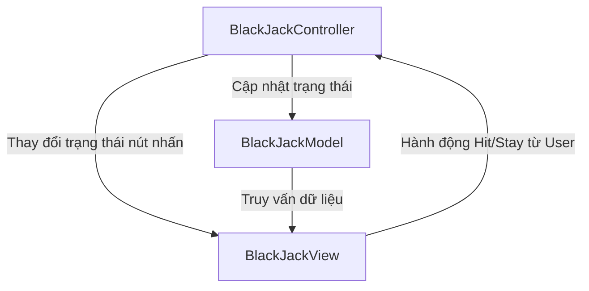

# 🃏 Game BlackJack - Kiến trúc MVC (Model-View-Controller)

Dự án này là phiên bản tái cấu trúc nâng cao của trò chơi **BlackJack** viết bằng Java Swing, áp dụng thiết kế mẫu chuyên nghiệp **MVC (Model-View-Controller)** nhằm chia tách rõ rệt dữ liệu logic, giao diện hiển thị và trình điều khiển sự kiện.

Đặc biệt, trong quá trình tái cấu trúc, chúng tôi đã **khắc phục hoàn toàn lỗi logic phân định thắng thua nghiêm trọng** trong mã nguồn nguyên bản để mang lại trải nghiệm luật chơi BlackJack chuẩn quốc tế.

---

## 🏗️ Cấu trúc thư mục MVC

Thư mục mã nguồn `src/` hiện tại được tổ chức như sau:

```text
BlackJack/
├── .gitignore
├── README.md
├── bin/
├── src/
│   ├── App.java                   # Điểm khởi chạy ứng dụng (Bootstrap)
│   ├── Card.java                  # Mô hình thực thể lá bài (Entity Model)
│   ├── BlackJackModel.java        # Xử lý logic nghiệp vụ và trạng thái game (Model)
│   ├── BlackJackView.java         # Thiết lập giao diện người dùng và vẽ đồ họa (View)
│   ├── BlackJackController.java   # Điều phối các hành động và nút nhấn (Controller)
│   └── cards/                     # Chứa các tài nguyên hình ảnh quân bài (.png)
```

---

## 📊 Sơ đồ luồng hoạt động MVC

Dưới đây là sơ đồ tương tác giữa các thành phần trong game:



---

## 🛠️ Chi tiết các thành phần

### 1. Entity Model: `Card.java`

- Đại diện cho một lá bài thuần túy chứa giá trị (`value` - ví dụ: "A", "J", "2") và chất bài (`type` - ví dụ: "C" nhép, "D" rô, "H" cơ, "S" bích).
- **Hoàn toàn tách biệt khỏi UI**: Không chứa mã nạp hoặc lưu trữ đường dẫn ảnh trực tiếp. Giao diện sẽ tự động chuyển đổi thông tin từ phương thức `toString()` (ví dụ: `2-C` thành ảnh `2-C.png`) để hiển thị.
- Tính toán điểm chuẩn: Lá hình người J, Q, K tính 10 điểm, lá A mặc định tính 11 điểm.

### 2. Game Model: `BlackJackModel.java`

- Quản lý bộ bài 52 lá, xáo bài (`shuffleDeck`), quản lý bài của Dealer (nhà cái) và Player (người chơi).
- Thực hiện thuật toán tối ưu hóa điểm số của quân Át (`reducePlayerAce`, `reduceDealerAce`), chuyển đổi giá trị Át từ 11 về 1 điểm khi tổng điểm vượt quá 21.
- **Sửa lỗi logic phân định kết quả**:
  - _Luật nguyên bản lỗi_: Người chơi vượt quá 21 điểm (Bust) hoặc điểm nhỏ hơn nhà cái lại hiển thị thắng, nhà cái vượt quá 21 điểm hiển thị thua người chơi.
  - _Luật đề xuất mới (Chuẩn)_:
    - Người chơi vượt quá 21 điểm: **Thua ngay lập tức (Bust)**.
    - Nhà cái vượt quá 21 điểm: **Người chơi thắng**.
    - Điểm bằng nhau: **Hòa (Tie)**.
    - Người chơi nhiều điểm hơn Nhà cái: **Người chơi thắng**.
    - Người chơi ít điểm hơn Nhà cái: **Người chơi thua**.

### 3. View: `BlackJackView.java`

- Thừa hành nhiệm vụ vẽ toàn bộ giao diện trò chơi trên nền vải xanh lá cây (`new Color(53, 101, 77)`) chuẩn sòng bài.
- Tự động tải tài nguyên hình ảnh quân bài từ thư mục `cards/` bằng Classloader.
- Ẩn lá bài đầu tiên của Dealer dưới dạng mặt sau (`BACK.png`) và chỉ lật lên khi người chơi nhấn **Stay** hoặc bị **Bust**.
- Cung cấp các API kích hoạt/vô hiệu hóa các nút nhấn Hit và Stay linh hoạt.

### 4. Controller: `BlackJackController.java`

- Lắng nghe và điều phối các sự kiện từ nút bấm người chơi:
  - **Nút Hit (Bốc bài)**: Thêm bài vào tay người chơi. Nếu tổng điểm vượt quá 21, tự động vô hiệu hóa các nút bấm, khóa trò chơi và hiển thị kết quả "You Lose!".
  - **Nút Stay (Dừng bốc)**: Khóa các nút bấm, kích hoạt nhà cái tự động bốc bài cho đến khi đạt tối thiểu 17 điểm, sau đó so sánh kết quả và vẽ thông báo kết quả tương ứng lên màn hình.

---

## 🚀 Hướng dẫn biên dịch và chạy game

Để chạy game trực tiếp từ dòng lệnh, bạn thực hiện theo các bước sau:

1.  **Di chuyển vào thư mục dự án**:

    ```bash
    cd BlackJack
    ```

2.  **Biên dịch toàn bộ mã nguồn vào thư mục `bin`**:

    ```bash
    javac -d bin src/*.java
    cp -r resources/* bin/
    ```

3.  **Chạy trò chơi**:
    ```bash
    java -cp bin App
    ```

---

## 🎨 Trải nghiệm giao diện cao cấp

- Bố cục màn hình rộng 600x600px cân đối, không thể co giãn để tránh méo đồ họa lá bài.
- Các lá bài được vẽ tỉ mỉ với độ phân giải cao tỉ lệ chuẩn 1:1.4.
- Phông chữ Arial nét lớn hiển thị thông báo trạng thái cực kỳ chuyên nghiệp và sang trọng khi kết thúc ván bài.
