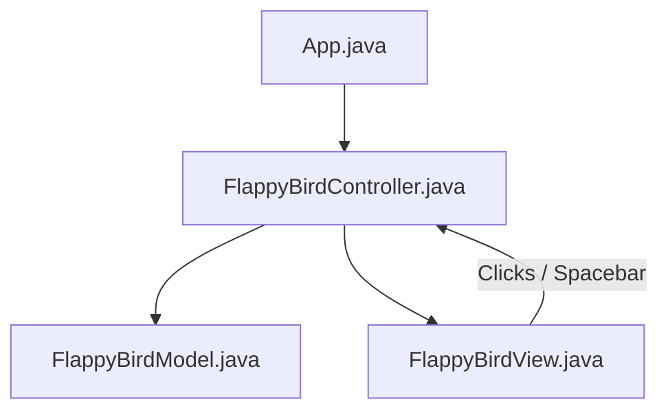

# 🐦 Flappy Bird (Java Swing - MVC)

Một phiên bản trò chơi **Flappy Bird** phong cách cổ điển tuyệt đẹp, được lập trình bằng ngôn ngữ Java và thư viện đồ họa Swing. Dự án đã được tái cấu trúc toàn diện theo mô hình thiết kế **MVC (Model-View-Controller)** chuyên nghiệp nhằm tách biệt hoàn toàn giữa dữ liệu vật lý và giao diện hiển thị đồ họa.

---

## 🏗️ Kiến Trúc Dự Án (MVC Pattern)

Dự án tuân thủ nghiêm ngặt mô hình thiết kế MVC để chia sẻ trách nhiệm rõ ràng:



- **Entities (`Bird.java`, `Pipe.java`)**: Các lớp thực thể thuần túy chứa thông tin tọa độ, kích thước, và trạng thái. Hoàn toàn không phụ thuộc hay lưu giữ đối tượng hình ảnh AWT `Image`.
- **Model (`FlappyBirdModel.java`)**: Quản lý toàn bộ trạng thái cốt lõi của game (vật lý trọng lực `gravity`, tốc độ bay nhảy `velocityY`, tọa độ chim, danh sách các chướng ngại vật `pipes`, điểm số `score` sử dụng kiểu dữ liệu `double` để giải quyết triệt để lỗi cộng điểm, và trạng thái kết thúc game).
- **View (`FlappyBirdView.java`)**: Chịu trách nhiệm hiển thị các thành phần đồ họa của trò chơi Swing (`JPanel`). Tải tài nguyên hình ảnh định dạng PNG (`flappybirdbg.png`, `flappybird.png`, `toppipe.png`, `bottompipe.png`) và vẽ các thực thể lên màn hình dựa trên dữ liệu lấy từ Model.
- **Controller (`FlappyBirdController.java`)**: Điều phối luồng hoạt động của game thông qua 2 Timer:
  1.  `gameLoop` (chạy ở tốc độ 60 FPS để cập nhật tọa độ vật lý và vẽ lại màn hình).
  2.  `placePipeTimer` (chạy mỗi 1500ms để sinh ra cặp ống ngẫu nhiên mới).
      Tiếp nhận các sự kiện bấm phím Space từ bàn phím để kích hoạt chim nhảy lên hoặc khởi động lại game.

---

## 🎮 Cách Chơi & Tính Năng

- **Cách Chơi**: Người chơi nhấn phím **Space** (khoảng trắng) để điều khiển chú chim vỗ cánh bay lên, vượt qua khe hở giữa các đường ống.
- **Trọng Lực & Vật Lý**: Chú chim sẽ liên tục chịu lực hút rơi xuống do gia tốc trọng lực tự nhiên.
- **Tính Điểm**: Vượt qua mỗi cặp ống thành công sẽ được cộng thêm `+1` điểm (mỗi ống đơn đóng góp `+0.5` điểm).
- **Kết Thúc Trò Chơi**: Nếu chú chim va chạm vào bất kỳ đường ống nào hoặc chạm đáy màn hình, game sẽ lập tức kết thúc. Người chơi có thể nhấn **Space** để chơi lại từ đầu.

---

## 📂 Cấu Trúc Thư Mục

```text
FlappyBird/
├── bin/                       # Thư mục chứa mã bytecode sau khi biên dịch
├── lib/                       # Các thư viện phụ thuộc (nếu có)
├── src/                       # Mã nguồn Java và hình ảnh tài nguyên
│   ├── App.java               # Điểm khởi chạy chương trình (Main)
│   ├── Bird.java              # Lớp thực thể chim Flappy
│   ├── Pipe.java              # Lớp thực thể ống chướng ngại vật
│   ├── FlappyBirdModel.java   # Lớp quản lý trạng thái cốt lõi và vật lý game
│   ├── FlappyBirdView.java    # Lớp hiển thị giao diện đồ họa và vẽ tài nguyên
│   ├── FlappyBirdController.java # Lớp điều phối luồng trò chơi & bắt phím Space
│   └── *.png                  # Các tài nguyên hình ảnh của game
├── .gitignore                 # Cấu hình loại bỏ các tệp không cần thiết khi git commit
└── README.md                  # Hướng dẫn chi tiết dự án
```

---

## 🚀 Hướng Dẫn Cài Đặt & Chạy Trò Chơi

### Yêu Cầu Hệ Thống

- Đã cài đặt **Java JDK 8** hoặc phiên bản mới hơn.

### Các Bước Thực Hiện

1.  Mở terminal tại thư mục `FlappyBird`.
2.  Biên dịch mã nguồn Java:
    ```bash
    javac -d bin src/*.java
    cp -r resources/* bin
    ```
3.  Chạy ứng dụng:
    ```bash
    java -cp bin App
    ```

---

## 🛠️ Hướng Phát Triển Tương Lai

- [ ] Thiết kế cơ chế đổi màu nền đêm/ngày tùy theo mức điểm đạt được.
- [ ] Bổ sung hiệu ứng quay góc nghiêng cho chú chim khi bay lên và rơi xuống.
- [ ] Bổ sung âm thanh sinh động khi vỗ cánh (wing), vượt qua ống (point), va chạm (hit) và rơi (die).
- [ ] Tích hợp bảng lưu điểm số kỷ lục (High Score).
