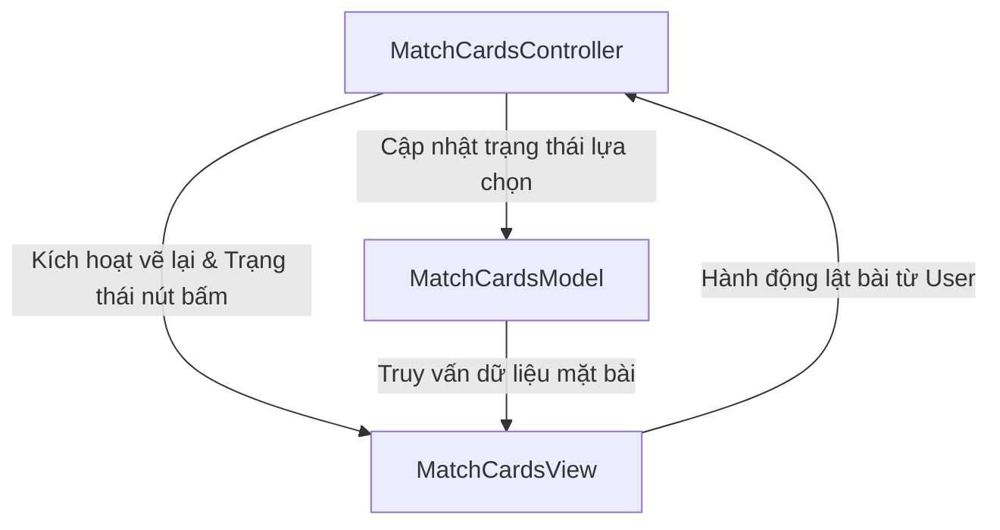

# 🃏 Game MatchCards - Kiến trúc MVC (Model-View-Controller)

Dự án này là phiên bản tái cấu trúc nâng cao của trò chơi **Pokemon Match Cards (Lật hình tìm cặp)** viết bằng Java Swing, áp dụng thiết kế mẫu chuyên nghiệp **MVC (Model-View-Controller)** nhằm tách biệt hoàn toàn phần giao diện hiển thị đồ họa khỏi phần lưu trữ và tính toán trạng thái game.

Đồng thời, mã nguồn mới đã loại bỏ việc so sánh ảnh trực tiếp của Swing, chuyển sang so sánh chuỗi định danh dữ liệu lá bài để đạt độ phân rã kiến trúc tối đa.

---

## 🏗️ Cấu trúc thư mục MVC

Thư mục mã nguồn `src/` hiện tại được tổ chức như sau:

```text
MatchCards/
├── .gitignore
├── README.md
├── bin/
├── src/
│   ├── App.java                   # Điểm khởi chạy ứng dụng (Bootstrap)
│   ├── Card.java                  # Mô hình thực thể lá bài Pokemon (Entity Model)
│   ├── MatchCardsModel.java       # Xử lý logic nghiệp vụ, điểm lỗi và trạng thái lưới bài (Model)
│   ├── MatchCardsView.java        # Thiết lập giao diện người dùng, tỷ lệ ảnh mượt mà (View)
│   ├── MatchCardsController.java  # Điều khiển thời gian lật úp lá bài và các sự kiện nhấn chuột (Controller)
│   └── img/                       # Chứa tài nguyên hình ảnh các thẻ Pokemon (.jpg)
```

---

## 📊 Sơ đồ luồng hoạt động MVC

Dưới đây là sơ đồ tương tác giữa các thành phần trong game:



---

## 🛠️ Chi tiết các thành phần

### 1. Entity Model: `Card.java`

- Đại diện cho thực thể một quân bài Pokemon chứa thuộc tính duy nhất là `cardName` (ví dụ: "darkness", "fairy", "water"...).
- **Hoàn toàn tách biệt khỏi UI**: Không chứa mã lưu trữ đối tượng `ImageIcon` hay luồng nạp ảnh trực tiếp của Swing. Nhờ đó, lớp này có thể dễ dàng tái sử dụng trên các nền tảng chạy Java khác (Console, Android...).

### 2. Game Model: `MatchCardsModel.java`

- Quản lý danh sách lưới bài (20 lá tương đương 10 cặp Pokemon), trạng thái xáo bài, và theo dõi mảng trạng thái `matched` (đã tìm thấy cặp) cùng `revealed` (đang mở mặt).
- Lưu trữ số lượt lật sai (`errorCount`), cờ sẵn sàng bắt đầu chơi (`gameReady`), và chỉ mục của hai lá bài đang được chọn (`card1Index` và `card2Index`).
- So sánh kết quả dựa trên tên lá bài bằng chuỗi logic:
  `model.getCard(card1).getCardName().equals(model.getCard(card2).getCardName())`
  Độ tin cậy tuyệt đối so với việc so sánh đối tượng `ImageIcon` cũ.

### 3. View: `MatchCardsView.java`

- Tải hình ảnh các lá bài Pokemon từ classpath (`/img/back.jpg` và `/img/<cardName>.jpg`).
- Thực hiện **Scale mượt mà** hình ảnh xuống kích cỡ chuẩn 90x128px bằng bộ lọc cao cấp `SCALE_SMOOTH` để tránh răng cưa.
- Cung cấp cấu trúc lưới đồ họa GridLayout kích thước 4x5, thanh lỗi Error ở đầu và nút bấm Restart ở cuối.
- Đồng bộ cập nhật hình ảnh các lá bài thông qua phương thức phản ứng `updateView()`.

### 4. Controller: `MatchCardsController.java`

- Thiết lập một Swing `Timer` hoạt động độc bản trong thời gian 1.5 giây (1500ms) để điều phối thời gian hiển thị:
  - **Lúc bắt đầu/chơi lại**: Hiển thị toàn bộ lưới bài trong 1.5 giây để người chơi ghi nhớ vị trí trước khi tự động lật úp toàn bộ xuống.
  - **Lúc chọn sai cặp**: Giữ nguyên hai lá bài đang mở trong vòng 1.5 giây để người chơi kịp nhìn thấy lỗi, sau đó úp ngược trở lại và xóa lượt lựa chọn.
- Chặn các lượt bấm bài trái phép trong thời gian đang chờ úp bài.

---

## 🚀 Hướng dẫn biên dịch và chạy game

Để biên dịch và khởi chạy game từ Command Line, vui lòng thao tác như sau:

1.  **Di chuyển vào thư mục dự án**:

    ```bash
    cd match-cards
    ```

2.  **Biên dịch toàn bộ mã nguồn vào thư mục `bin`**:

    ```bash
    javac -d bin src/*.java
    cp -r resources/* bin
    ```

3.  **Chạy trò chơi**:
    ```bash
    java -cp bin App
    ```

---

## 🎨 Trải nghiệm giao diện cao cấp

- Kích thước cửa sổ tự động tối ưu hóa qua phương thức `frame.pack()` để ôm khít khịt lưới bài mà không thừa pixel thừa.
- Giao diện hiển thị đếm lỗi hiển thị dạng phông Arial 20 sắc nét.
- Hình ảnh các quân bài sắc sảo, không hề bị kéo giãn lệch tỷ lệ nhờ cơ chế chia tỉ lệ chuẩn của View.
