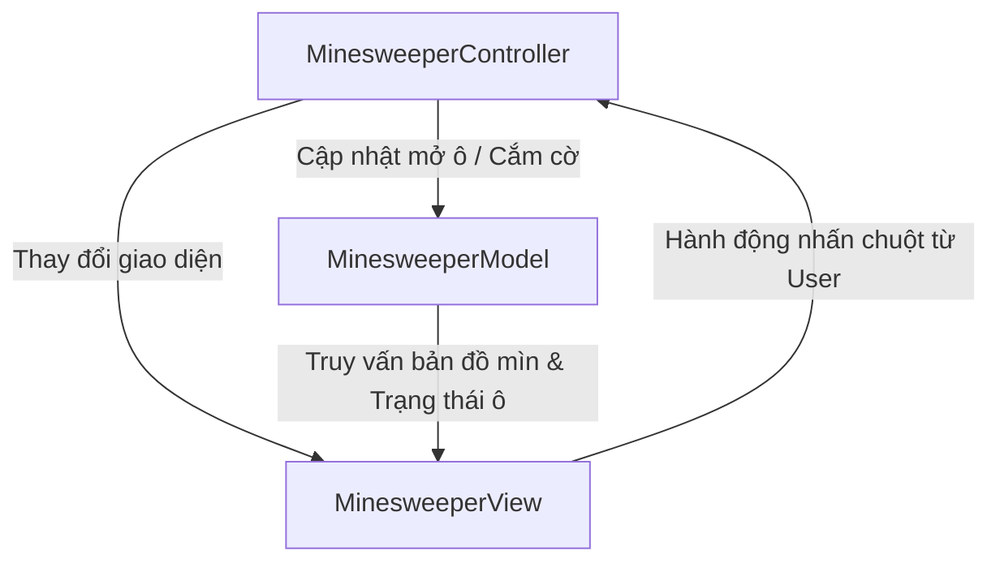

# 💣 Game Minesweeper - Kiến trúc MVC (Model-View-Controller)

Dự án này là phiên bản tái cấu trúc nâng cao của trò chơi **Minesweeper (Dò mìn)** viết bằng Java Swing, áp dụng thiết kế mẫu chuyên nghiệp **MVC (Model-View-Controller)** nhằm phân rã hoàn toàn logic cốt lõi của game (vị trí mìn, thuật toán lan truyền dọn ô trống) khỏi giao diện vẽ đồ họa và luồng lắng nghe sự kiện chuột.

---

## 🏗️ Cấu trúc thư mục MVC

Thư mục mã nguồn `src/` hiện tại được tổ chức như sau:

```text
Minesweeper/
├── .gitignore
├── README.md
├── bin/
├── src/
│   ├── App.java                   # Điểm khởi chạy ứng dụng (Bootstrap)
│   ├── MinesweeperModel.java      # Lưu trữ bản đồ, tính toán mìn và thuật toán loang (Model)
│   ├── MinesweeperView.java       # Thiết lập cửa sổ Jframe, lưới ô bấm và hiển thị Emoji (View)
│   ├── MinesweeperController.java  # Tiếp nhận sự kiện chuột trái (mở ô) và chuột phải (cắm cờ) (Controller)
```

---

## 📊 Sơ đồ luồng hoạt động MVC

Dưới đây là sơ đồ tương tác giữa các thành phần trong game:



---

## 🛠️ Chi tiết các thành phần

### 1. Game Model: `MinesweeperModel.java`

- Quản lý bản đồ lưới kích cỡ cố định 8x8 chứa tổng cộng 10 quả mìn được phân bổ ngẫu nhiên độc bản.
- Lưu trữ các ma trận trạng thái thuần túy:
  - `boolean[][] mines`: Xác định sự hiện diện của mìn tại ô (r, c).
  - `boolean[][] revealed`: Xác định ô (r, c) đã được mở hay chưa.
  - `boolean[][] flagged`: Xác định ô (r, c) đang cắm cờ cảnh báo.
  - `int[][] surroundingMines`: Pre-calculate (tính toán trước) số lượng mìn xung quanh 8 ô lân cận để phản hồi tức thời.
- **Thuật toán Loang tự động (Recursive Flood-Fill)**: Khi người chơi mở trúng một ô có 0 quả mìn xung quanh, Model tự động quét loang đệ quy mở rộng tất cả các ô trống lân cận cho đến khi gặp ô có mìn xung quanh. Logic này chạy hoàn toàn độc lập với Swing.
- Phân định thắng/thua dựa trên số ô đã mở: Thắng khi người chơi mở hết `boardRows * boardCols - mineCount` ô trống.

### 2. View: `MinesweeperView.java`

- Dựng cửa sổ `JFrame` kích cỡ tĩnh 560x560px cân đối với kích thước mỗi ô lưới 70px.
- Hiển thị thanh chỉ báo HUD sắc nét trên cùng bằng phông Arial Bold cỡ 25 để đếm ngược số mìn hoặc vẽ chữ kết quả chung cuộc ("Mines Cleared!" / "Game Over").
- Grid ô bấm gồm 64 `JButton` cấu hình phông chữ tương thích ký tự Emoji `"Arial Unicode MS"` cỡ 45 để hiển thị sinh động hình ảnh bom `"💣"` và cờ đỏ `"🚩"`.

### 3. Controller: `MinesweeperController.java`

- Gắn bộ lắng nghe sự kiện chuột `MouseAdapter` chuyên biệt lên từng ô bấm trong lưới 8x8.
- Phân tích hành động tương tác chính xác:
  - **Chuột trái (`MouseButton1`)**: Gọi phương thức mở ô `model.clickTile(r, c)`. Nếu mở trúng bom, kích hoạt trạng thái thua và mở toàn bộ bản đồ bom.
  - **Chuột phải (`MouseButton3`)**: Gọi phương thức cắm cờ `model.toggleFlag(r, c)` để hỗ trợ đánh dấu vị trí nghi ngờ.
- Vô hiệu hóa toàn bộ tương tác chuột khi trò chơi kết thúc.

---

## 🚀 Hướng dẫn biên dịch và chạy game

Để biên dịch và khởi chạy game từ dòng lệnh, bạn vui lòng thao tác:

1.  **Di chuyển vào thư mục dự án**:

    ```bash
    cd minesweeper
    ```

2.  **Biên dịch toàn bộ mã nguồn vào thư mục `bin`**:

    ```bash
    javac -d bin src/*.java
    ```

3.  **Chạy trò chơi**:
    ```bash
    java -cp bin App
    ```

---

## 🎨 Trải nghiệm đồ họa

- Sử dụng phông chữ Unicode cao cấp hiển thị Emojis bom và cờ tuyệt đẹp trên hệ điều hành Mac OS / Windows mà không cần nạp ảnh bên ngoài.
- Các ô mìn đã mở tự động vô hiệu hóa chuyển sang màu xám mờ tinh tế, nổi bật số lượng mìn xung quanh rõ ràng giúp người chơi phân tích đường đi tiếp theo.
