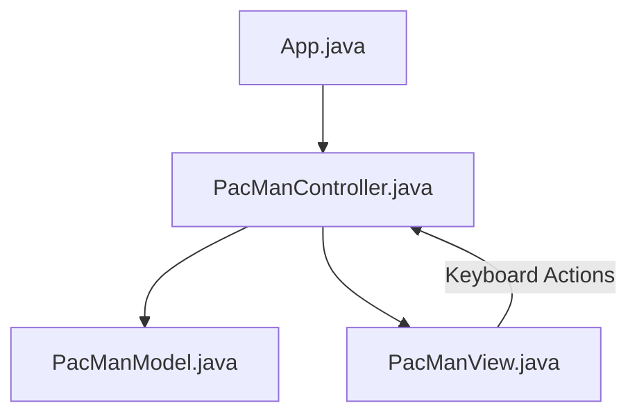

# 🟡 Pac-Man (Java Swing - MVC)

Một phiên bản trò chơi **Pac-Man** cổ điển tuyệt đẹp, được viết bằng ngôn ngữ Java và giao diện Swing. Dự án đã được tái cấu trúc hoàn chỉnh từ mã nguồn nguyên bản sang mô hình thiết kế **MVC (Model-View-Controller)** tiên tiến, giúp phân tách triệt để dữ liệu vật lý khỏi giao diện đồ họa.

---

## 🏗️ Kiến Trúc Dự Án (MVC Pattern)

Dự án tuân thủ chặt chẽ mô hình thiết kế MVC để mang lại sự độc lập giữa các lớp phần mềm:



- **Entity Model (`PacManBlock.java`)**: Lớp đại diện độc lập cho các đối tượng trên bàn cờ (tường, thức ăn, quái vật Ghost, nhân vật Pac-Man). Lưu trữ kích thước, tọa độ, vận tốc và hướng di chuyển mà không phụ thuộc vào bất kỳ thư viện vẽ giao diện nào.
- **Game Model (`PacManModel.java`)**: Lưu trữ và cập nhật trạng thái trò chơi (lưới bản đồ, điểm số, mạng chơi `lives`, trạng thái kết thúc `gameOver`). Chứa toàn bộ các thuật toán vật lý như tính toán va chạm, di chuyển ngẫu nhiên và thông minh của các Ghosts, và cơ chế tính điểm khi ăn thức ăn.
- **View (`PacManView.java`)**: Kế thừa `JPanel`. Phụ trách nạp tài nguyên hình ảnh định dạng PNG (`wall.png`, các hướng Pac-man, các loại Ghosts). Dựa vào dữ liệu từ Model để vẽ giao diện trò chơi và hiển thị bảng điểm HUD trên màn hình.
- **Controller (`PacManController.java`)**: Điều phối nhịp độ game thông qua Timer chạy chu kỳ 50ms (ActionTick). Tiếp nhận các sự kiện bàn phím từ người chơi (Key Listener), ra lệnh cập nhật vật lý cho Model, yêu cầu View vẽ lại giao diện và xử lý hồi sinh/khởi động lại khi game kết thúc.

---

## 🎮 Cách Chơi & Tính Năng

- **Nhiệm Vụ**: Điều khiển Pac-man ăn hết tất cả các chấm thức ăn màu trắng trên bản đồ để giành chiến thắng màn chơi và bước sang màn tiếp theo.
- **Kẻ Địch**: Bốn chú ma dễ thương (Red, Blue, Pink, Orange) tuần tra ngẫu nhiên và thông minh trên bản đồ để truy lùng Pac-man.
- **Tính Điểm & Mạng chơi**:
  - Ăn một chấm thức ăn được cộng `+10` điểm.
  - Va chạm với quái vật ma sẽ bị trừ đi `1` mạng. Game bắt đầu với `3` mạng.
  - Khi mạng chơi chạm mốc `0`, màn hình sẽ hiển thị thông báo "Game Over". Nhấn phím bất kỳ sau đó để chơi lại từ đầu.

---

## 📂 Cấu Trúc Thư Mục

```text
PacMan/
├── bin/                       # Thư mục chứa mã bytecode sau khi biên dịch
├── lib/                       # Các thư viện phụ thuộc (nếu có)
├── src/                       # Mã nguồn Java và hình ảnh tài nguyên
│   ├── App.java               # Điểm khởi chạy chương trình (Main)
│   ├── PacManBlock.java       # Lớp đối tượng vật lý cơ sở
│   ├── PacManModel.java       # Lớp quản lý trạng thái, vật lý & điểm số
│   ├── PacManView.java        # Lớp hiển thị giao diện đồ họa & tải ảnh
│   ├── PacManController.java  # Lớp điều phối game loop & nhận nút bấm
│   └── *.png                  # Các tệp hình ảnh đồ họa của game
├── .gitignore                 # Cấu hình loại bỏ các tệp không cần thiết khi git commit
└── README.md                  # Hướng dẫn chi tiết dự án
```

---

## 🚀 Hướng Dẫn Cài Đặt & Chạy Trò Chơi

### Yêu Cầu Hệ Thống

- Đã cài đặt **Java JDK 8** hoặc phiên bản mới hơn.

### Các Bước Thực Hiện

1.  Mở terminal tại thư mục `PacMan`.
2.  Biên dịch mã nguồn Java:
    ```bash
    javac -d bin src/*.java
    cp -r resources/* bin
    ```
3.  Chạy ứng dụng:
    ```bash
    java -cp bin App
    ```

---

## 🛠️ Hướng Phát Triển Tương Lai

- [ ] Bổ sung quả Cherry (Cherry Food) sinh ngẫu nhiên để tăng điểm thưởng lớn.
- [ ] Cơ chế Ăn Thức Ăn Sức Mạnh (Power Food): Pac-man có thể tạm thời đuổi bắt và ăn các Ghosts ở trạng thái sợ hãi (Scared Ghosts).
- [ ] Bổ sung cơ chế cổng Dịch chuyển tức thời (Teleport tunnels) ở dòng 9 (hai biên bên trái và bên phải bản đồ).
- [ ] Tích hợp bảng lưu điểm số kỷ lục (High Score).
