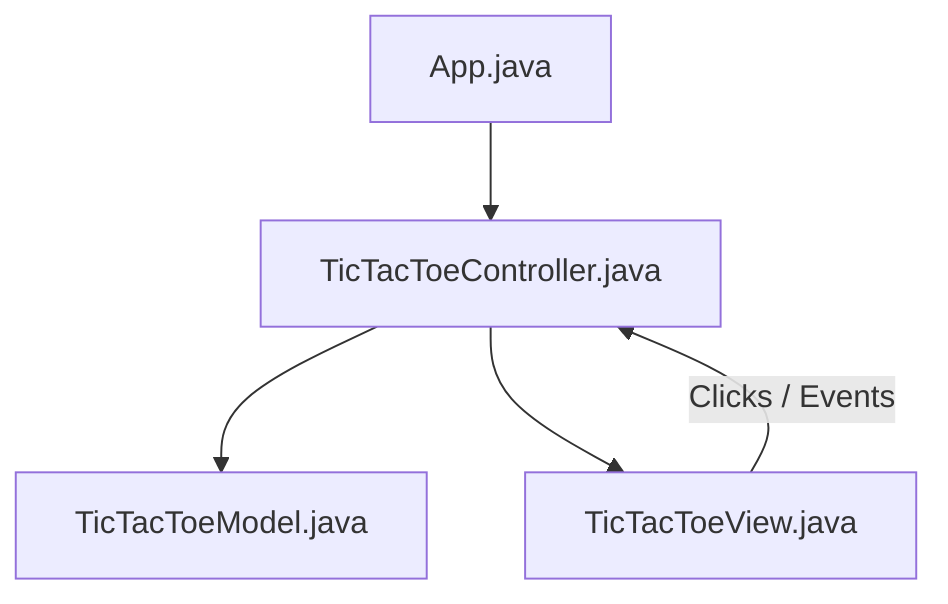

# ❌⭕ Tic-Tac-Toe (Java Swing - MVC)

Một phiên bản trò chơi **Tic-Tac-Toe** (Cờ ca-rô 3x3) cổ điển tuyệt đẹp, được phát triển bằng ngôn ngữ Java và giao diện đồ họa Swing. Dự án đã được tái cấu trúc hoàn chỉnh theo mô hình **MVC (Model-View-Controller)** chuyên nghiệp nhằm tách biệt dữ liệu trò chơi, giao diện người dùng và logic điều phối.

---

## 🏗️ Kiến Trúc Dự Án (MVC Pattern)

Dự án tuân thủ nghiêm ngặt mô hình thiết kế MVC để chia sẻ trách nhiệm rõ ràng:



*   **Model (`TicTacToeModel.java`)**: Lưu trữ và kiểm soát trạng thái ma trận bàn cờ 3x3 (`boardState`), lượt chơi hiện tại của người chơi (`X` hoặc `O`), số lượt chơi (`turns`), và trạng thái game. Chứa thuật toán xác định kết quả thắng/thua/hòa thông qua cấu trúc trả về `WinResult` linh hoạt.
*   **View (`TicTacToeView.java`)**: Chịu trách nhiệm hiển thị các thành phần đồ họa của trò chơi Swing (`JFrame`, lưới các nút bấm `JButton[][]`, bảng hiển thị trạng thái `JLabel`). Báo hiệu tương tác nhấp chuột của người dùng thông qua callback `TileClickListener`.
*   **Controller (`TicTacToeController.java`)**: Điều phối luồng chạy của trò chơi. Bắt sự kiện người dùng từ View, xác thực tính hợp lệ của nước đi trong Model, cập nhật lại trạng thái bàn cờ, kiểm tra chiến thắng/hòa và chỉ đạo View hiển thị kết quả (tô màu chiến thắng xanh lá hoặc tô màu hòa cam).

---

## 🎮 Cách Chơi & Tính Năng

*   **Luật Chơi Cổ Điển**: Hai người chơi thay phiên nhau đặt các ký hiệu `X` và `O` vào lưới ô vuông 3x3.
*   **Xác Định Chiến Thắng**: Người chơi đầu tiên có được 3 ký hiệu thẳng hàng (ngang, dọc, hoặc chéo) sẽ giành chiến thắng.
*   **Hiển Thị Trực Quan**:
    *   **Thắng cuộc**: Các ô vuông thắng cuộc sẽ được tô nền xám và chữ **màu xanh lá** (`Color.green`), đồng thời hiển thị thông báo chiến thắng.
    *   **Hòa cuộc**: Khi cả 9 ô đều được điền đầy mà không có ai thắng, toàn bộ bàn cờ sẽ được tô nền xám chữ **màu cam** (`Color.orange`) và thông báo "Tie!".
*   **Chống Ghi Đè Nước Đi**: Các ô đã được điền ký hiệu sẽ bị vô hiệu hóa, không cho phép nhấn đè hoặc thay đổi.

---

## 📂 Cấu Trúc Thư Mục

```text
tic-tac-toe/
├── bin/                       # Thư mục chứa mã bytecode sau khi biên dịch
├── lib/                       # Các thư viện phụ thuộc (nếu có)
├── src/                       # Mã nguồn Java
│   ├── App.java               # Điểm khởi chạy chương trình (Main)
│   ├── TicTacToeModel.java    # Lớp quản lý dữ liệu, lượt chơi & thuật toán thắng cuộc
│   ├── TicTacToeView.java     # Lớp thiết lập và hiển thị giao diện đồ họa Swing
│   └── TicTacToeController.java # Lớp trung gian điều phối trò chơi
├── .gitignore                 # Cấu hình loại bỏ các tệp không cần thiết khi git commit
└── README.md                  # Hướng dẫn chi tiết dự án
```

---

## 🚀 Hướng Dẫn Cài Đặt & Chạy Trò Chơi

### Yêu Cầu Hệ Thống
*   Đã cài đặt **Java JDK 8** hoặc phiên bản mới hơn.

### Các Bước Thực Hiện
1.  Mở terminal tại thư mục `tic-tac-toe`.
2.  Biên dịch mã nguồn Java:
    ```bash
    javac -d bin src/*.java
    ```
3.  Chạy ứng dụng:
    ```bash
    java -cp bin App
    ```

---

## 🛠️ Hướng Phát Triển Tương Lai
*   [ ] Bổ dung tính năng Chơi lại ngay (Restart/Reset button) trực tiếp trên giao diện.
*   [ ] Lưu trữ lịch sử tỉ số thắng giữa người chơi X và O (Score board).
*   [ ] Phát triển chế độ chơi với máy tính (AI Single Player) sử dụng thuật toán Minimax.
*   [ ] Mở rộng bàn cờ lên kích thước lớn hơn (ví dụ: cờ Caro 5 quân thắng).