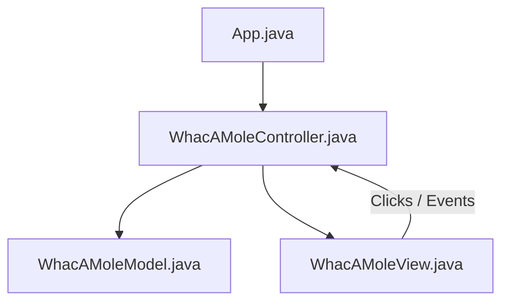

## Getting Started

# 🍄 Mario: Whac-A-Mole (Java Swing - MVC)

Welcome to the VS Code Java world. Here is a guideline to help you get started to write Java code in Visual Studio Code.
Một trò chơi **Whac-A-Mole** (Đập chuột chũi) phong cách Mario cổ điển, được viết bằng ngôn ngữ Java và thư viện đồ họa Swing. Dự án đã được tái cấu trúc hoàn toàn theo mô hình thiết kế **MVC (Model-View-Controller)** chuyên nghiệp nhằm tối ưu hóa tính độc lập, khả năng bảo trì và phát triển lâu dài.

## Folder Structure

---

The workspace contains two folders by default, where:

## 🏗️ Kiến Trúc Dự Án (MVC Pattern)

- `src`: the folder to maintain sources
- `lib`: the folder to maintain dependencies
  Mã nguồn được phân tách rõ ràng thành ba lớp thành phần để đảm bảo triết lý Single Responsibility (Đơn nhiệm):
  Meanwhile, the compiled output files will be generated in the `bin` folder by default.



> If you want to customize the folder structure, open `.vscode/settings.json` and update the related settings there.

- **Model (`WhacAMoleModel.java`)**: Quản lý toàn bộ trạng thái cốt lõi của game (điểm số, trạng thái kết thúc, tọa độ hiện tại của Mole và Plant). Hoàn toàn độc lập với giao diện Swing.
- **View (`WhacAMoleView.java`)**: Xử lý toàn bộ giao diện đồ họa (Windows, Panels, Grid JButtons). Tự động tải, tối ưu kích thước và vẽ các asset ảnh (`monty.png`, `piranha.png`). Lắng nghe hành vi click thông qua callback interface `TileClickListener`.
- **Controller (`WhacAMoleController.java`)**: Trực tiếp điều phối dòng chảy của game. Quản lý timers chuyển động của Mole (1000ms) và Plant (1500ms), bắt các sự kiện từ View để cập nhật Model và điều phối lại View.

## Dependency Management

---

The `JAVA PROJECTS` view allows you to manage your dependencies. More details can be found [here](https://github.com/microsoft/vscode-java-dependency#manage-dependencies).

# WhacAMole-Java

## 🎮 Cách Chơi & Tính Năng

- **Tính Điểm**: Đập trúng chú chuột chũi Monty Mole (biểu tượng chuột) để được cộng `+10` điểm.
- **Kết Thúc Trò Chơi**: Nếu vô tình đập phải cây ăn thịt Piranha Plant (biểu tượng cây), game sẽ kết thúc ngay lập tức.
- **Đồ Họa Mượt Mà**: Asset hình ảnh được co giãn chất lượng cao (`SCALE_SMOOTH`) ở độ phân giải 150x150px phù hợp với lưới game 3x3.
- **Chuyển Động Độc Lập**: Tần suất xuất hiện của Mole và Plant là độc lập, đảm bảo tính bất ngờ cao cho trò chơi.

---

## 📂 Cấu Trúc Thư Mục

```text
whac-a-mole/
├── bin/                       # Thư mục chứa mã bytecode sau khi biên dịch
├── lib/                       # Các thư viện phụ thuộc (nếu có)
├── src/                       # Mã nguồn Java
│   ├── img/                   # Thư mục chứa hình ảnh tài nguyên
│   │   ├── monty.png          # Ảnh Monty Mole
│   │   └── piranha.png        # Ảnh Piranha Plant
│   ├── App.java               # Điểm khởi chạy chương trình (Main)
│   ├── WhacAMoleModel.java    # Quản lý dữ liệu & trạng thái game
│   ├── WhacAMoleView.java     # Quản lý giao diện Swing
│   └── WhacAMoleController.java # Quản lý logic nghiệp vụ và Timers
├── .gitignore                 # Cấu hình bỏ qua các tệp không cần thiết khi git commit
└── README.md                  # Hướng dẫn chi tiết dự án
```

---

## 🚀 Hướng Dẫn Cài Đặt & Chạy Trò Chơi

### Yêu Cầu Hệ Thống

- Đã cài đặt **Java JDK 8** hoặc phiên bản mới hơn.

### Các Bước Thực Hiện

1.  Mở terminal tại thư mục `whac-a-mole`.
2.  Biên dịch mã nguồn Java:
    ```bash
    javac -d bin src/*.java
    ```
3.  Chạy ứng dụng:
    ```bash
    java -cp bin App
    ```

---

## 🛠️ Hướng Phát Triển Tương Lai

- [ ] Tích hợp tính năng Lưu điểm số cao nhất (High Score).
- [ ] Bổ sung màn hình chờ (Start Screen) và nút Chơi lại (Restart Game).
- [ ] Cho phép nhiều Piranha Plant hoặc Monty Mole xuất hiện cùng lúc ở các cấp độ khó cao hơn.
